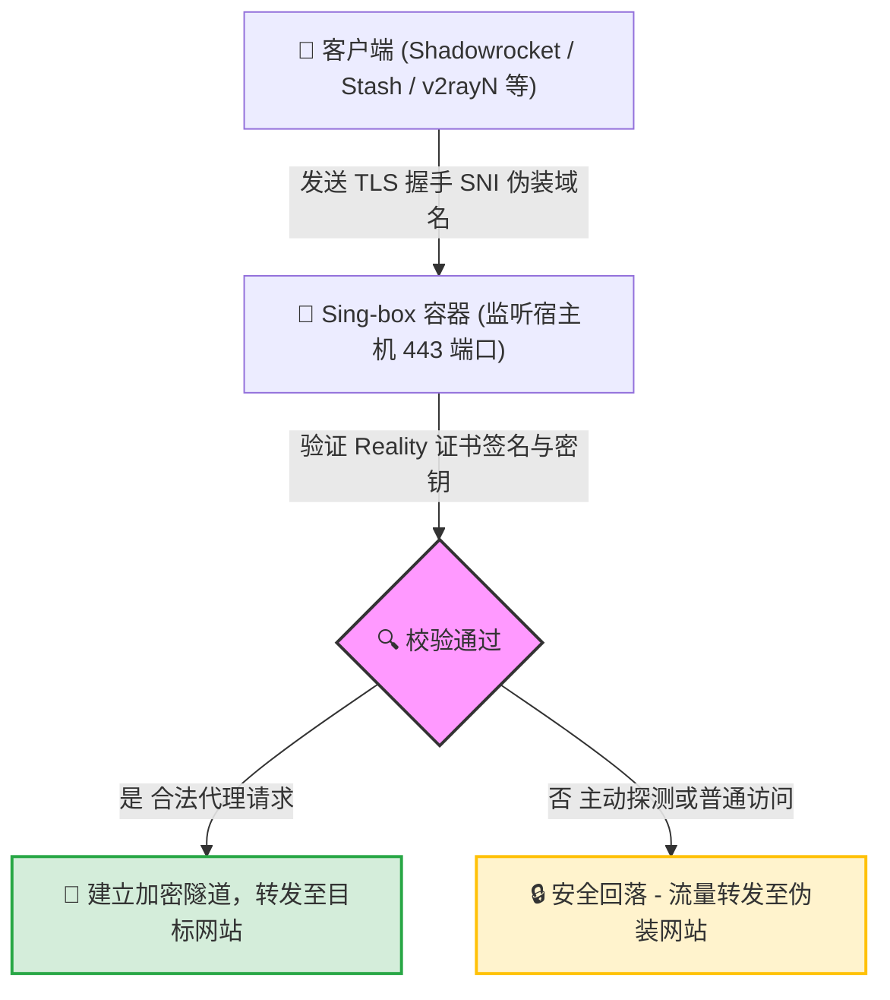

# 🚀 Sing-box Docker Server Manager

> 基于 Docker 与 VLESS-XTLS-Reality 协议的极简、安全、高性能代理服务一键部署方案。

<p align="left">
  
  
  
  
</p>

---

## 📖 项目简介

本项目旨在通过高度自动化的脚本，在您的 Linux 服务器上一键拉取并部署官方最新的 **Sing-box** 代理服务端。服务独占 **`443`** 端口，借助 **Reality** 协议的证书借用特性，无需自备域名和证书，即可实现极高抗封锁性的加密数据传输。

### 🛡️ 工作原理与伪装架构

当流量到达您的服务器 `443` 端口时，Sing-box 会对其执行 TLS 验证。如果是来自您客户端的合法认证流量，将建立安全代理通道；如果是第三方主动探测或普通用户流量，则会无感重定向（回落）至目标网站。



---

## ✨ 核心特性

*   🔒 **无感完美伪装**：采用先进的 Reality 偷渡技术，偷用大厂（默认 `dl.google.com`）合法的 TLSv1.3 证书进行混淆，完美逃避主动探测。
*   👥 **多用户管理文件化**：在 `config/users.txt` 中通过简单的按行增删用户名，即可全自动维护多用户节点。
*   🔄 **非破坏性增量更新**：重运行部署脚本时，**自动保留已有老用户的 UUID 凭证与服务器私钥**。老用户无需重新导入配置，仅对新加入用户做增量派发，对移出的用户做即时停用。
*   🔗 **一键导出直连与 JSON 配置**：部署完成或更新配置后，终端将以高亮色彩批量生成所有用户的专属 `vless://` 连接（可即刻扫码或复制导入客户端），并会在 `config/` 目录下自动生成专属于官方 Sing-box 客户端的 `<username>_client.json` 配置文件。

---

## 📂 目录结构

项目目录已实现最精简、扁平的设计：

```text
.
├── docker-compose.yml       # Docker 服务容器编排文件
├── singbox.sh               # 交互式命令行控制面板脚本
├── README.md                # 项目文档
└── config/                  # 配置数据持久化目录
    ├── users.txt            # [用户维护] 每一行配置一个用户名
    ├── config.json          # [自动生成] 服务端 sing-box 主配置文件
    ├── client_links.txt     # [自动生成] 备份的客户端直连订阅链接
    ├── <username>_client.json # [自动生成] 专为官方 Sing-box 客户端定制的 JSON 配置文件
    └── subs/                # [自动生成] 订阅分发目录，映射至 Sub Server 用于官方扫码一键导入
```

---

## ⚡ 快速开始

> [!IMPORTANT]
> 执行部署前，请确保您服务器的 **`443/tcp`** 和 **`443/udp`** 端口未被其他服务（如 Nginx, Apache 或 Caddy）占用，并且防火墙已放行上述端口。

在服务器终端中以 **root** 权限一键调起交互式管理面板（无需手动配置，首次启动会自动引导安装并创建默认用户 `admin`）：

```bash
sudo bash singbox.sh
```

---

## 🛠️ 控制面板功能介绍

通过一键调起面板，您可以极其方便地通过输入数字菜单键完成所有运维操作：

1. **Install & Deploy Service**：首次部署服务。会引导检测 Docker、获取 IP/配置自定义连接域名，并全自动生成配置。
2. **Start Service**：一键启动 Sing-box 容器。
3. **Stop Service**：一键停止并注销 Sing-box 容器。
4. **Restart Service**：重启 Sing-box 容器使配置生效。
5. **Uninstall Service**：彻底清理服务（包含容器清理、镜像删除以及整个 `config/` 目录的抹除）。
6. **Update Sing-box Version**：一键拉取最新的官方镜像并热重启，升级完成后自动打印最新运行的内核版本。
7. **Show Trojan Links & QR Codes**：列出所有用户的 Trojan 链接，并可交互式选择在终端控制台直接渲染扫码二维码。
8. **Add User**：交互式添加新用户（自动增量重载，**完全保留已有老用户的 UUID 与密钥**，对其不产生任何干扰）。
9. **Delete User**：交互式删除用户，选择序号即可将对应用户安全清除并重载服务。
10. **View Real-time Logs**：实时查看代理日志（自动携带 `--tail=100` 安全限制，防止历史日志刷屏卡死终端）。

---

## 📱 客户端支持矩阵

复制部署输出的 `trojan://` 链接并直接导入至以下推荐的主流客户端：

> [!IMPORTANT]
> **💡 协议兼容性与内核要求**
> 本服务部署的节点基于标准的 **Trojan** 协议并使用 TLS 加密。如果您需要使用非推荐列表中的其他第三方客户端，请确保该客户端满足以下全部技术指标：
> 1. **基础协议**：必须原生支持 **`Trojan`** 传输协议。
> 2. **安全传输**：必须支持 **`TLS`** 加密传输。
> 3. **证书校验**：由于服务端默认生成自签名证书，客户端必须支持且开启 **`Allow Insecure / 允许不安全证书`** 选项以忽略证书链校验。

> [!TIP]
> iOS 平台下的所有代理客户端（Shadowrocket, Sing-box 等）均已从中国大陆区 App Store 下架，下载时**需使用非中国大陆区的 Apple ID**。

| 平台 | 推荐客户端 | 协议支持说明 |
| :--- | :--- | :--- |
| **iOS** | **[Shadowrocket](https://apps.apple.com/app/shadowrocket/id932747118)** | 原生完美支持，**推荐首选** |
| | **[Karing](https://apps.apple.com/us/app/karing/id6472431552)** | 界面现代美观，支持多种规则配置 |
| **macOS** | **[Sing-box (官方)](https://github.com/SagerNet/sing-box/releases)** | 官方客户端，**推荐首选** |
| | **[Shadowrocket](https://apps.apple.com/app/shadowrocket/id932747118)** | 完美支持 |
| | **[Karing](https://apps.apple.com/us/app/karing/id6472431552)** | 界面现代美观，支持多种规则配置 |
| **Android** | **[Surfboard](https://play.google.com/store/apps/details?id=com.getsurfboard)** | 界面精致美观，完美支持 Trojan 协议，**推荐首选** |
| | **[Karing](https://karing.app)** | 界面现代美观，支持多种规则配置 |
| **Windows** | **[Karing](https://karing.app)** | 界面现代美观，支持多种规则配置，**推荐首选** |
| **OpenWrt** | **[OpenClash](https://github.com/vernesong/OpenClash)** | 选用 Mihomo (Clash.Meta) 内核后完美支持 |
| | **[PassWall](https://github.com/xiaorouji/openwrt-passwall)** | 选用 Xray / Sing-box 内核即可连通 |
| | **[HomeProxy](https://github.com/immortalwrt/homeproxy)** | 基于官方 Sing-box 核心的代理插件，原生支持 |

---


---

## 📝 配置文件说明
- **配置用户列表**：[config/users.txt](./config/users.txt) （日常只需修改此文件来增删用户）。
- **服务端运行配置**：[config/config.json](./config/config.json) （自动维护，切勿手动乱改，防格式损毁）。
- **已生成链接备份**：[config/client_links.txt](./config/client_links.txt) （包含用户专属连接，可随时打开复制）。